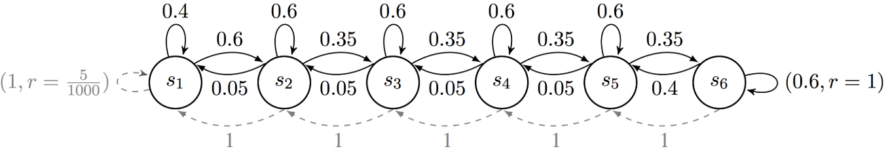
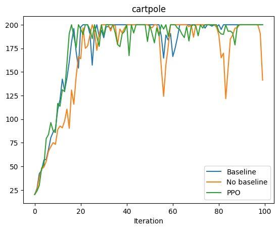

# CS234_Reinforcement_Learning (Spring 2024)

This repo mainly contains Stanford CS234 2024spring assignment's coding problems. The official course website is [here](https://web.stanford.edu/class/cs234/), which contains entire course materials.

Feel free to follow the instructions in each problem directory to run and test it.
## A1_P4: RiverSwim MDP

## A2_P2: Policy Gradient Methods

## A3_P1-P3: Reward engineering, Learning from preferences(RLHF), Direct preference optimization(DPO)

### PPO (without early termination)

### PPO(with early termination)

### RLHF

